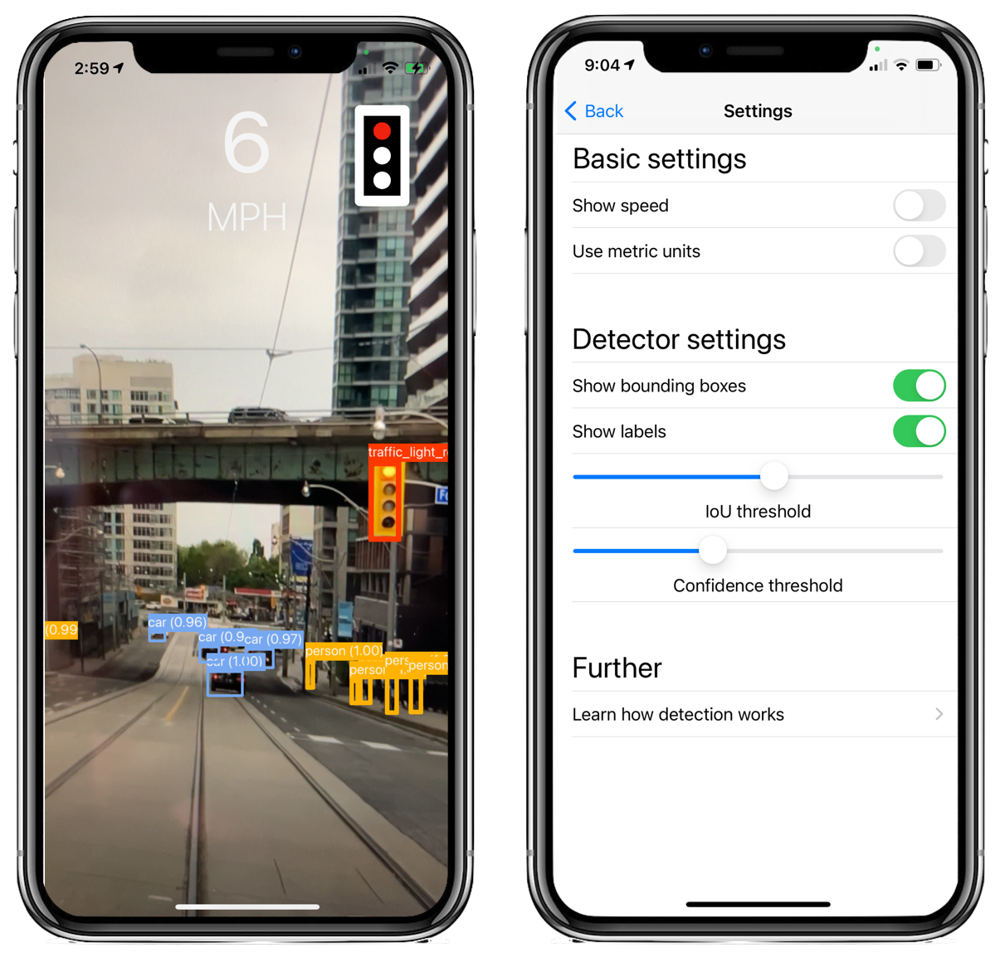
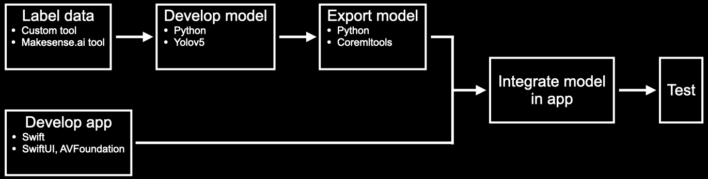

# Driver Assistant

**Disclaimer:** This is an experimental app which was made to show how to use object detection in iOS. Do not rely on it in traffic, always keep your eyes on the road, and check your local regulations before using it.

A computer vision-based driver assistant which highlights important objects such as stop signs, traffic lights, and pedestrians. Traffic lights and stop signs are displayed as icons for better visibility next to the current speed.


# Overview
When launching the app, the vision model runs and the speed is calculated with GPS sensor data. You can tap the screen to show and hide the settings button at the bottom of the screen.

<center></center>

The app has the following features.
- Detects 14 classes of objects
- Highlights stop signs and traffic lights, including their indication states
- Displays the current speed

By default, the app displays bounding boxes, labels, and the speed. In settings, you can enable or disable displaying any of those options.. In addition to these features, you can adjust the object detector’s IOU threshold and confidence threshold in the settings.


# How to use
This app requires XCode to install. To get started, clone this repository, open the project with `DriverAssistant.xcodeproj` and build it. Then connect your iPhone and select your iPhone under "device" in XCode and install the app. Make sure you select a valid profile under Signing & Capabilities, otherwise the app won’t compile.


# Implementation details
The following are details regarding the implementation. The figure shows the different steps and how they relate to each other.




## Label data
For the project we generated [COCO Traffic](link to coco traffic repo), a subset of the COCO dataset with the traffic lights relabelled with the indication states. The result is a dataset with 14 classes relevant to traffic scenes.


## Developing the object detector
We use a yolov5s model (link to the yolo repo) which we trained for 75 epochs on the data. We did not evaluate the model on an independent test set which is why we don’t quantify the performance here.


# Using a CoreML model in the app
This section is particularly interesting if you want to modify the app.

## Exporting the YOLOv5 model into CoreML
Although there is an export function provided by Glenn Jocher and the YOLOv5 team, the trace function used in it does not export many of the post-processing steps such as adjusting the coordinates to be relative to the image rather than the grid cell. Fortunately, Leon de Andrade and Dennis Post (Thank you very much) have provided a repo to export the YOLOv5 model with all of these post-processing steps [here](https://github.com/dbsystel/yolov5-coreml-tools).

We have used their repo to export out model with some minor modifications. An older version of YOLOv5 (v4.0) has been provided with this repo for your convenience. The following instructions are based on the original [repo by Leon de Andrade](https://github.com/dbsystel/yolov5-coreml-tools).

To export the model into CoreML, [install poetry](https://python-poetry.org/docs/). Poetry is used to install the required libraries to export the model. Export it by navigating to the export/yolov5-coreml-tools folder and then using the following command

```console 
$ poetry install
```

CoreML tools only works for certain versions of PyTorch, so the following commands may be preferred

```
$ pyenv install 3.8.6
$ pyenv global 3.8.6
$ poetry install
```

In the src/coreml_export/main.py folder, you may want to change some of the variables such as

* `classLabels` -> A list of the names of the classes. In COCO, there are 80 classes.
* `anchor` -> This depends on the YOLOv5 model that you are using (x, m, l, xl). This can be found in the "yolo<model>.yml" file
* `reverseModel` -> Some models reverse the order of the anchors and strides, so this is used to quickly switch reverse their order.

Then you may paste your .pt network model in the yolov5-coreml-tools folder. To finally run the export program, you may use the command

```
$ poetry run coreml-test --model-input-path <path to .pt file>
```

And you can use the -h flag to get a list of the optional arguments for your export. The model will save your exported model in the output/models folder.


## Integrating the model into Swift
Once the exported model has been added to the project, you have to call it with the `VNVisionRequest`.

Apple provides an [example](https://developer.apple.com/documentation/vision/recognizing_objects_in_live_capture) for an object detection app. To use it with your own model, you might have to adjust the geometric transformation. For more details on these transformations see [here](link to upcoming post on the transformation).
